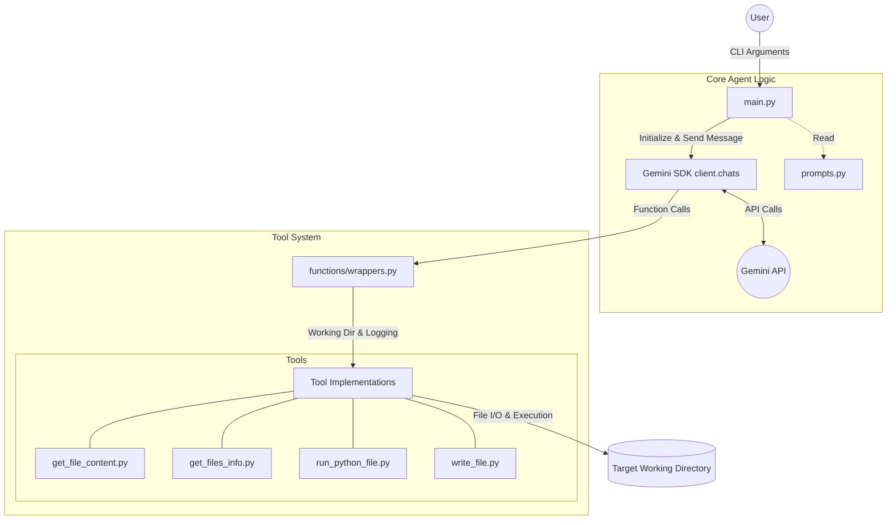

# Architecture Overview

This document describes the architecture of the `aiagent` application, a basic Python-based AI agent that leverages the Gemini SDK to assist users with file operations and script execution.

## System Architecture

The application is structured around a central agent script that initializes a Gemini chat session and equips it with specialized tools for interacting with the local filesystem.

## Components

### 1. `main.py`
The entry point of the application. Its responsibilities include:
- Parsing command-line arguments (e.g., user prompt, verbose flag).
- Loading environment variables (like `GEMINI_API_KEY`).
- Initializing the `google.genai.Client`.
- Configuring the tool environment (e.g., setting the target working directory and verbosity level in `wrappers`).
- Managing the interaction loop via `client.chats.create`, injecting the `SYSTEM_PROMPT` and `wrappers.tools_list`.
- Displaying usage metadata and the final agent response.

### 2. `prompts.py`
Contains the core instructions for the AI agent (`SYSTEM_PROMPT`). It defines:
- The agent's persona and goals.
- Explicit guidelines on when to use which tools.
- Critical operational rules (e.g., enforcing that paths are relative to the working directory).

### 3. `functions/wrappers.py`
A vital intermediary layer between the Gemini SDK and the underlying tool implementations.
- **State Management:** Holds global configuration like `VERBOSE` and `WORKING_DIRECTORY` to abstract these details away from the LLM.
- **SDK Integration:** Provides clean, statically typed Python functions that the Gemini 3.1 SDK can automatically infer schemas from (`tools_list`).
- **Logging:** Handles the output formatting when a tool is invoked, based on the verbosity setting.

### 4. `functions/*.py` (Tool Implementations)
The actual implementation logic for the tools available to the agent. These are decoupled from SDK specifics and focus strictly on executing their given task securely within the bounds of the `working_directory`.
- `get_file_content`: Reads text from a file.
- `get_files_info`: Lists the contents and sizes of files within a directory.
- `run_python_file`: Executes a Python script as a subprocess and captures standard output and errors.
- `write_file`: Creates or overwrites files.

### 5. `calculator/` (Target Directory)
The designated sandbox or workspace that the agent acts upon. The `WORKING_DIRECTORY` in `wrappers.py` is currently locked to `./calculator`. All tool file paths are relative to this directory.
